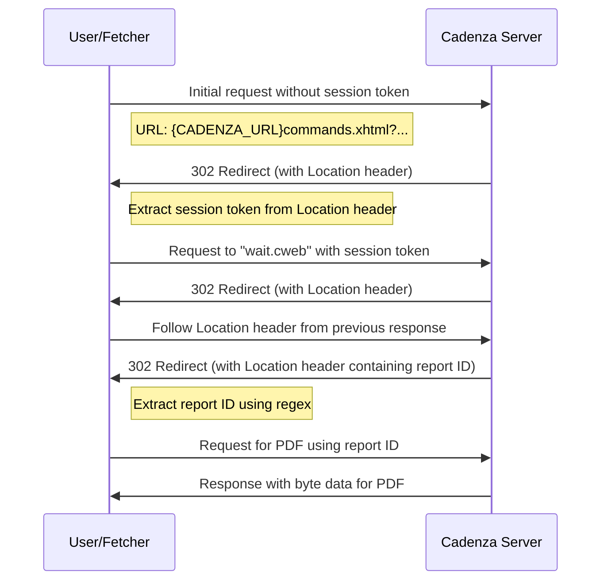

<h1 align="center">NLWKN Fetcher</h1>
<h3 align="center">nlwkn-rs</h3>
<p align="center">
  <b>📥 Automated tool for fetching water right reports from the Cadenza platform.</b>
</p>

## Overview
The fetcher tool is specifically designed to automate the process of downloading 
water right reports from the Cadenza platform. 
While the platform provides a downloadable XLSX table containing most of the 
water rights data, it lacks crucial allowance values, such as the rate of water 
extraction. 
These details are available in individual PDF reports accessible via the 
platform's map view.

<!-- 
TODO: add image here

-->

Downloading thousands of these PDFs manually is impractical. 
The fetcher tool streamlines this process by automating the download of all 
available water right reports. 
To use the fetcher effectively, you need to provide it with water right 
numbers, which can be sourced from the aforementioned XLSX table.

<!-- 
TODO: add image here

-->

## How It Works
The traditional method of obtaining a report involves manually selecting a dot 
on the map and downloading the PDF from the subsequent popup. 
However, the fetcher tool optimizes this process by leveraging the platform's 
backend communication.

### Process Diagram


### Communication Breakdown:
#### 1. Session Token Acquisition:
- The initial request doesn't require a session token.

- Request URL: 
  `{CADENZA_URL}commands.xhtml?ShowLegacy.RepositoryItem.Id=FIS-W.WBE.wbe/wbe_net_wasserrecht.cwf&ShowLegacy.RepositoryItem.Value='{water_right_no}'&ShowLegacy.RepositoryItem.Attribute=wbe_net_wasserrecht.wasserrecht_nr`

- Use the Firefox browser's User-Agent to mimic a valid browser.

- The response is a 302 redirect. 
  Extract the session token from the Location header by identifying the value 
  after `;jsessionid=`.

#### 2. Report Generation Wait:
- Construct a new URL: `{CADENZA_URL}wait.cweb;jsessionid={j_session_id}`

- The response is another 302 redirect. 
  Follow the `Location` header.

#### 3. Report ID Extraction:
- The subsequent 302 response contains the report ID in the `Location` header.

- Extract the report ID using the regex pattern: 
  `r"\?file=rep(?<report_id>\d+)\.pdf"`

#### 4. PDF Download:
- Construct the final URL: 
  `{CADENZA_URL}/pages/download/get;jsessionid={j_session_id}?file=rep{report_id}.pdf&mimetype=application/pdf`

- The response contains the byte data for the desired PDF.

This method eliminates the need for virtual browser instances and relies 
solely on simple GET requests. 
Moreover, the majority of responses are 302 redirects without attached HTML, 
reducing server load and ensuring the fetcher's continuous operation.

## Efficiency and Smart Fetching
On a virtual machine, the fetcher took approximately 5 days to crawl all water 
rights. 
However, the tool is designed to be efficient. 
It detects which water rights are already available locally and fetches only 
the missing ones, preventing unnecessary downloads and further reducing the 
time required.

## Anonymity and Rate Limiting
To ensure user privacy and avoid potential tracking 
(even though academic crawling is permitted), the fetcher operates behind a 
TOR instance. 
It utilizes the [arti](https://gitlab.torproject.org/tpo/core/arti/-/wikis/home) 
project, a Rust implementation of TOR, to establish a SOCKS proxy. 
This approach negates the need to manually launch TOR or expect a running TOR 
instance.

Furthermore, the fetcher is designed to request one report at a time, 
preventing server overloads and ensuring responsible data retrieval.

## Usage
### Command Line Interface
```
NLWKN Water Right Webcrawler

Usage: fetcher.exe <XLSX_PATH>

Arguments:
  <XLSX_PATH>  Path to cadenza-provided xlsx file

Options:
  -h, --help     Print help
  -V, --version  Print version
```

### Steps to Run
1. Obtain water right numbers from the downloadable XLSX table on the Cadenza 
   platform.

2. Provide these numbers to the fetcher.

3. Run the fetcher and let it handle the automated download process.

## Disclaimer
This tool is intended for academic and research purposes. 
Ensure you have the necessary permissions and adhere to ethical guidelines 
when using it.
